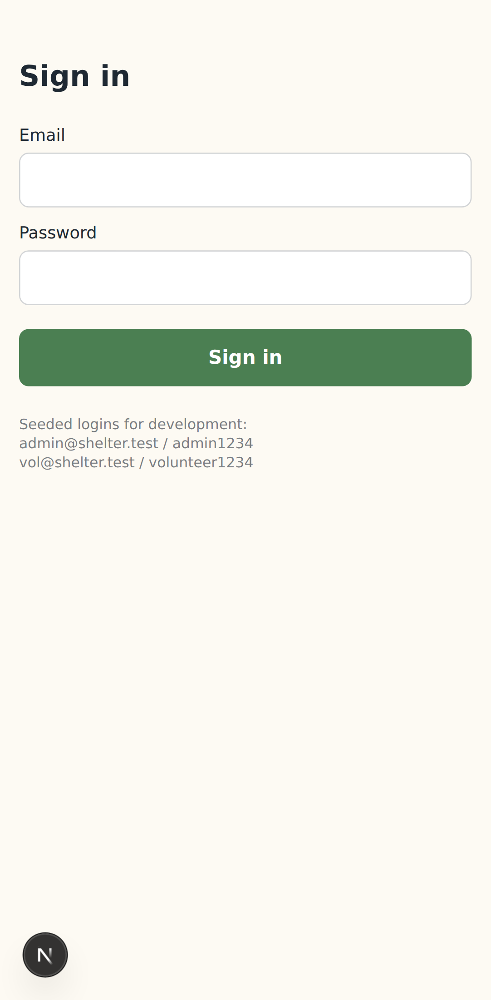
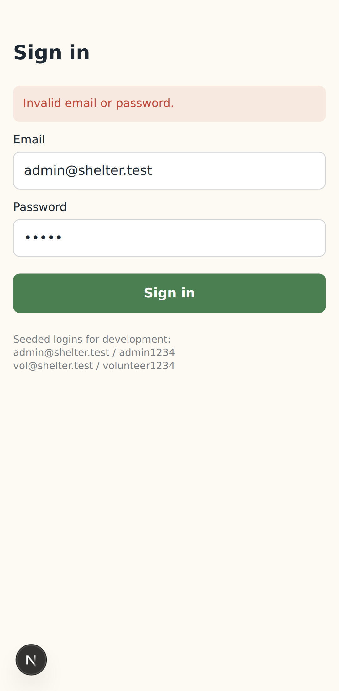
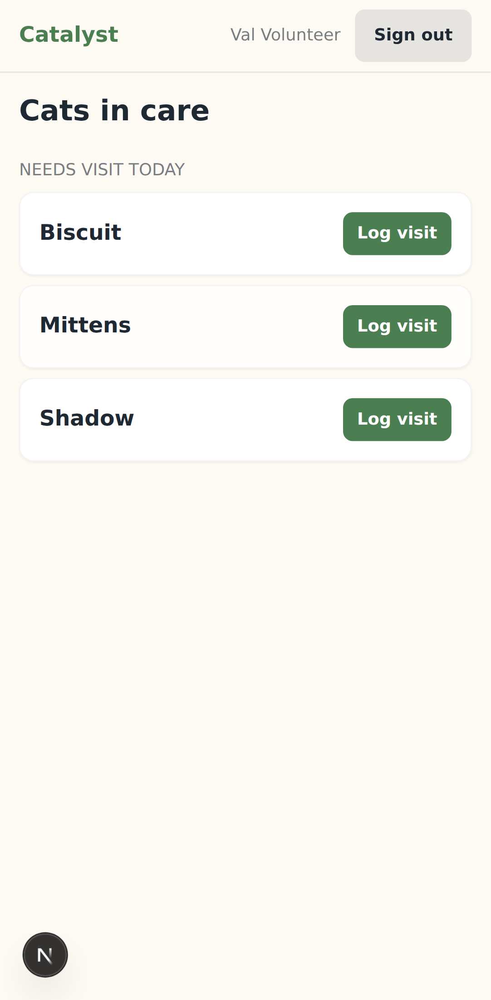
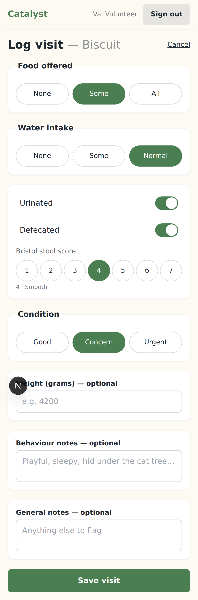
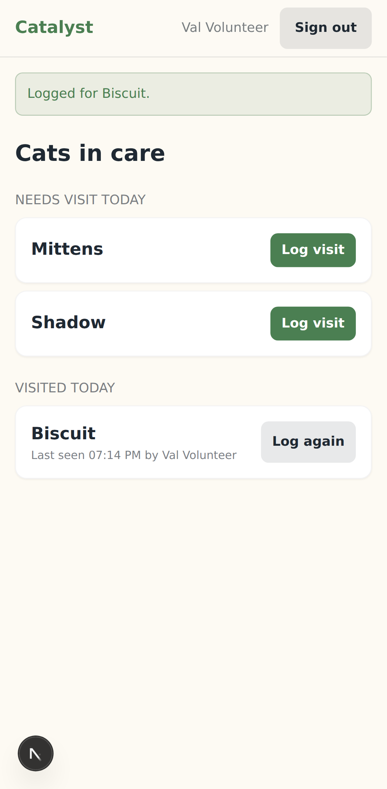
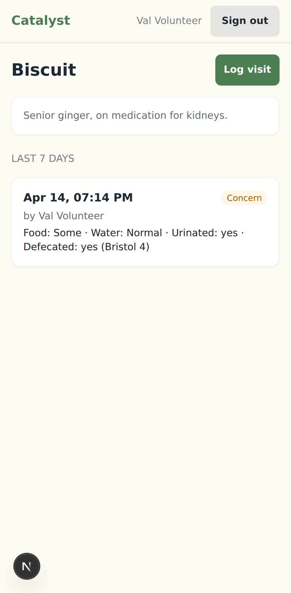
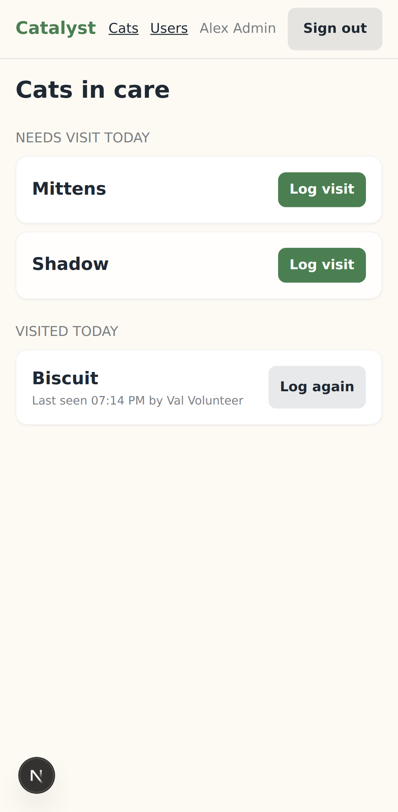
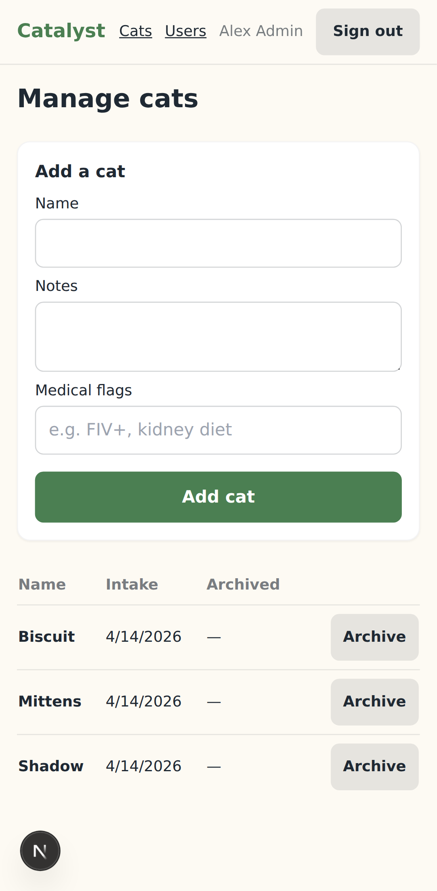
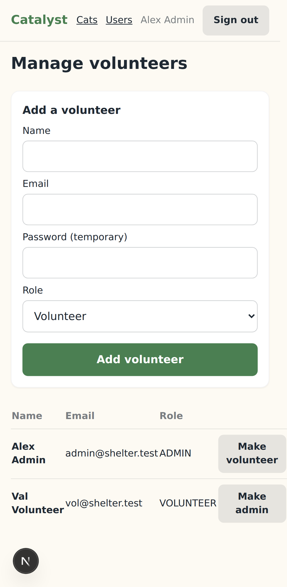

# Catalyst — UI tour

Screenshots captured with Playwright on a Pixel 7 viewport (412×915). Tap-target minimum is 44 px throughout.

## 1. Login



## 2. Login — wrong password



## 3. Volunteer dashboard — fresh shelter, no visits yet



## 4. The critical screen — log visit form, filled in

Food = Some, Water = Normal, urinated on, defecated on → Bristol picker appears, 4 selected, Condition = Concern.



## 5. Dashboard after saving

Green toast confirms the save; the cat moves from "Needs visit today" to "Visited today" with a "Log again" CTA.



## 6. Cat profile — last 7 days

Shows the entry we just saved, the volunteer who recorded it, and a condition chip.



## 7. Admin dashboard

Same cats view as a volunteer sees, but the header grows extra "Cats" and "Users" nav links.



## 8. Admin → Manage cats



## 9. Admin → Manage volunteers



---

To regenerate these locally:

```bash
PORT=3100 npx playwright test e2e/_screenshots.spec.ts
# outputs PNGs to test-results/
```
